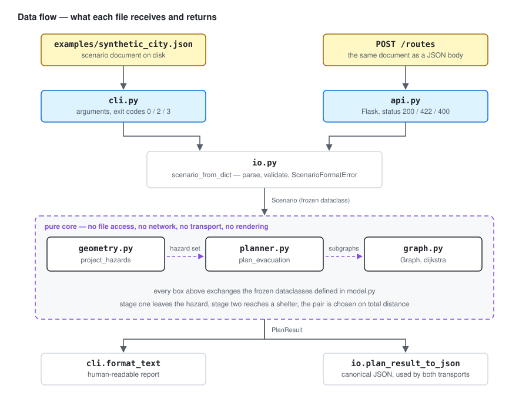

# Two-Stage Evacuation Router

[](https://github.com/sean-from-japan/two-stage-evacuation-router/actions/workflows/ci.yml)

An evacuation route should not stop at the first safe-looking road. This project finds a shortest valid route that first leaves a hazard and then reaches an eligible shelter, while explaining every exit and shelter it accepted or rejected.

The repository demonstrates deterministic graph algorithms, geometry at a system boundary, constrained optimization, machine-readable explanations, independent correctness oracles, and publication-safe retrospective engineering.

## Historical context and authorship

The original idea came from a **group Super Science High School (SSH) research project in 2022**. The historical system combined an Android/Java application with a Flask web API, used GIS information and device location, and applied Dijkstra's algorithm in two stages: leave the hazard area, then reach an evacuation shelter. The Android client was the graphical shell; route computation and GIS data management lived in the web service.

I was responsible for system design and implementation. The group discussed and decided both the routing algorithm and the choice to build an application. The original work was therefore a team project, not my solo project.

This repository is a later, independent reimplementation. It contains no original submission code, school documents, team members' code, real locations, original GIS data, binaries, or private Git history. Its synthetic data, architecture, tests, diagrams, and wording were created for this retrospective. Features such as global complete-route optimization, structured rejection reasons, polygon boundary handling, and cross-check tests are later improvements; they are not claims about the high-school submission.

## Run the demonstration

Python 3.11 or newer is supported. The routing core has no runtime dependencies, and neither the core nor the CLI performs any network access.

```bash
python -m pip install -e .
evacuation-route plan examples/synthetic_city.json
```

The synthetic city deliberately makes the nearest exit a poor complete route:

```text
Exit: exit-far
Shelter: hill-school (shelter-hill)
Stage 1: 4 via start -> inner-north -> exit-far
Stage 2: 2 via exit-far -> shelter-hill
Total: 6
```

The nearer exit costs only `2` in stage one but produces a total of `13`. The CLI reports it as an alternative and also explains that the other shelters are closed, inside the hazard, or unreachable. Add `--format json` for stable machine-readable output. Exit codes are `0` for a route, `2` for no valid route, and `3` for invalid input.

## Run the HTTP service

The original system computed routes in a web service and used the Android client as a graphical shell over it. The optional `api` extra reproduces that boundary — the service, not the client — with Flask.

```bash
python -m pip install -e '.[api]'
flask --app two_stage_router.api run
```

`POST /routes` accepts the same scenario document the CLI reads and returns the same explanation. Its status codes mirror the CLI exit codes: `200` for a route, `422` for a valid scenario with no valid route, and `400` for malformed input. `GET /health` reports the package version.

```bash
curl -X POST http://127.0.0.1:5000/routes \
  -H 'Content-Type: application/json' \
  --data @examples/synthetic_city.json
```

Both transports render the plan through one serializer, and a test asserts their payloads are byte-identical, so the CLI and the service cannot drift apart.

## Routing model

The core consumes an undirected road graph with positive weights, a start node, candidate shelters, and either hazard polygons, hazardous node identifiers, or both.

1. Polygon geometry is projected onto graph nodes. A point on a polygon boundary is hazardous by conservative policy.
2. If the start is hazardous, stage one runs Dijkstra on hazardous nodes plus their adjacent safe exit nodes. Each path therefore ends at its first safe node.
3. From every reachable exit, stage two runs Dijkstra on the safe-only subgraph and evaluates every shelter.
4. The router selects the feasible `(exit, shelter)` pair with minimum **stage-one distance + stage-two distance**. Ties use stage-one distance, exit identifier, then shelter identifier.
5. If the start is already safe, stage one is the zero-length path at the start.

This objective is intentionally not greedy. Choosing the nearest exit first can produce a longer or impossible journey to a shelter. The test suite includes a counterexample and checks the complete planner against exhaustive simple-path enumeration.

## Architecture



`graph.py`, `geometry.py`, and `planner.py` do not read files, use the network, render maps, or depend on the CLI or the service. Input parsing, HTTP, and presentation are adapters. See [the detailed architecture and invariants](docs/architecture.md).

### Deployment concept

The historical system ran the routing service behind an Android shell and fed it stored GIS data. This diagram separates that intent from what is actually here, and records where real Japanese map data would and would not fit.


Only the middle tier exists in this repository. The client and the data store are drawn dashed because they are design intent, not code. [The map data note](docs/gis-data.md) records the survey behind the three data boxes.

## Engineering decisions

- **Minimize the complete constrained route:** a greedy two-call pipeline is simpler but can choose the wrong exit.
- **Project geometry at the boundary:** routing works with hazardous node sets, so it remains testable without a GIS library or map service.
- **Treat the boundary as hazardous:** an exact boundary location is not assumed safe.
- **Explain all candidates:** each exit retains stage distances and each shelter records a route or a rejection reason.
- **Use a standard-library runtime:** the demonstration stays offline and reproducible.
- **Reproduce the service boundary, not the client:** the historical system carried its engineering in the web service, so that is what the HTTP adapter reproduces. An Android GUI would add surface that cannot be verified in CI without strengthening the routing argument, so no client is included.
- **Share one serializer between transports:** `plan_result_to_json` renders every response, and a test pins the CLI and HTTP payloads to each other.

## Development and verification

Development tools are pinned in `pyproject.toml`.

```bash
python -m pip install -e '.[dev]'
ruff check .
ruff format --check .
mypy src
pytest
python scripts/audit_repository.py . --git-history
```

Tests cover graph validation, deterministic paths, polygon interiors and boundaries, starts inside/outside hazards, disconnected graphs, multiple exits and polygons, unsafe/ineligible/unreachable shelters, no-route results, CLI and HTTP contracts, and invalid input. Dijkstra distances are cross-checked against an independent Bellman-Ford implementation on deterministic small graphs. The complete two-stage choice is separately checked against exhaustive simple paths.

GitHub Actions runs linting, formatting, type checks, tests, the CLI demonstration, and the publication audit on Linux, macOS, and Windows across supported Python 3.11-3.14 releases.

## Privacy and ownership

Only newly authored code, prose, and synthetic fixtures are committed. The repository excludes real GIS archives. The licensing and format survey behind that decision is recorded in [the map data note](docs/gis-data.md); in short, hazard polygons are redistributable, but the routable road network the algorithm consumes is not available on compatible terms. It also excludes real device locations, addresses, school materials and branding, student identifiers, teammates' identities, credentials, original APKs, recovered prototypes, and the original project history.

The audit checks both the working tree and all Git blobs for contact details, local home paths, likely identifiers, private keys, and common credential formats. That is defense in depth, not a substitute for reviewing future contributions.

## Limitations

- A polygon affects an edge only through its endpoint nodes; segment-polygon intersection is not modelled.
- Hazard polygons are combined as a union. The router does not model hazard type, severity, time evolution, congestion, capacity, or uncertainty.
- Weights are abstract positive costs, not live walking times.
- Node coordinates and edge weights are independent. Coordinates decide hazard membership only; they do not determine distance. Real map data would have to supply both consistently.
- The graph is undirected and static; turn restrictions and one-way roads are outside the model.
- Runtime Dijkstra results are not a formal safety guarantee, and this demonstration is not for emergency use.

## License

Every included file was newly authored for this retrospective and is available under the [MIT License](LICENSE).

